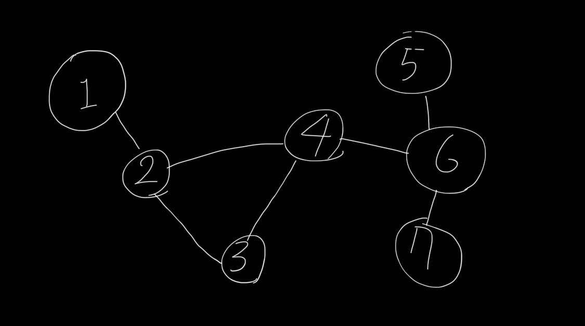
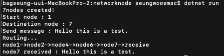

# This repo was created to study C# and, network routing.

> ### Topology
>
> 
>
> ### Execution screen
>
> 
>
> 1. Set sending node
> 2. Set receiving node
> 3. Set message
> 4. Check the path that your message passed through
>
> ### To Do
>
> ```
> 1. First, add links that connect each nodes.
> 2. Second, make a function that updates routing tables
>    by referring to the traffic on the link.
> ```
